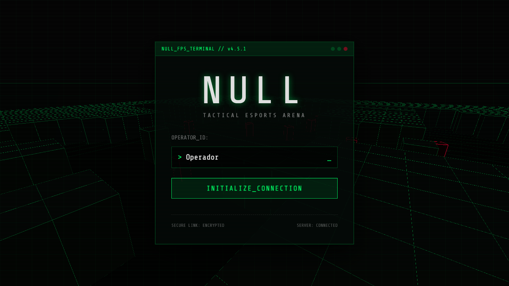
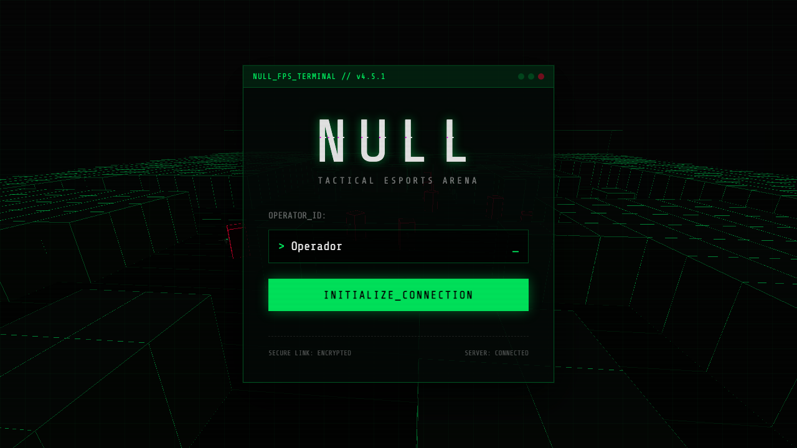

<div align="center">

# ⚡ NULL FPS

### Multiplayer Browser FPS — Hacker Aesthetic



<br />



<br />

[](LICENSE)


**A fast, low-poly multiplayer FPS that runs entirely in the browser.**
<br/>
**Built with Three.js + Geckos.io (UDP) — optimized for integrated GPUs.**

</div>

---

## 🎮 Features

| Feature | Description |
|---|---|
| **Procedural Maps** | Every match generates a unique map from a seed (rooms, corridors, arena, cover) |
| **Multiplayer (UDP)** | Real-time networking via Geckos.io with authoritative server |
| **AI Bots** | A* pathfinding, line-of-sight detection, state machine (Wander / Chase / Shoot) |
| **4 Weapons** | Pistol, SMG (full-auto), Shotgun, Sniper — each with unique stats |
| **Combat Feedback** | Hitmarkers, damage indicators, kill banners, camera shake |
| **Progression** | XP system, leveling, kill streaks (Double Kill → Godlike) |
| **Minimap Radar** | Live 2D canvas minimap with player/bot tracking |
| **Hacker UI** | CRT scanlines, glitch effects, terminal-style interface |
| **Low-End Optimized** | Runs at 60 FPS on integrated GPUs (Lambert shading, InstancedMesh, no post-processing) |

---

## 📂 Project Structure

```
null-fps/
├── client/                  # Frontend (Vite + Three.js)
│   ├── index.html           # UI structure (Lobby, HUD, Scoreboard)
│   ├── style.css            # Hacker/cyberpunk CSS theme
│   └── src/
│       ├── main.js          # Game loop, input, network events
│       ├── engine.js        # Three.js renderer, map builder, entity manager
│       ├── weapons.js       # Weapon definitions + 3D models
│       ├── feedback.js      # Hitmarkers, damage indicators, camera shake
│       ├── minimap.js       # Canvas 2D radar
│       ├── progression.js   # XP, levels, kill streaks
│       ├── input.js         # Keyboard & mouse input handler
│       └── network.js       # Geckos.io client connection
├── server/                  # Backend (Node.js + Geckos.io)
│   ├── server.js            # Authoritative game server (30 tick)
│   └── bots.js              # Bot AI (A* pathfinding, state machine)
├── shared/                  # Shared between client & server
│   └── map.js               # Procedural map generator + A* + Line of Sight
├── package.json
├── LICENSE
└── README.md
```

---

## 🚀 Quick Start

### Prerequisites

- [Node.js](https://nodejs.org/) >= 18

### Installation

```bash
# Clone the repository
git clone https://github.com/YOUR_USERNAME/null-fps.git
cd null-fps

# Install all dependencies (root + client + server)
npm run install:all
```

### Run

```bash
# Start both server and client
npm run dev
```

Then open **http://localhost:5173** in your browser.

---

## 🕹️ Controls

| Key | Action |
|---|---|
| `W A S D` | Move |
| `Mouse` | Look around |
| `Left Click` | Shoot |
| `Shift` | Sprint |
| `Ctrl` | Slide |
| `Space` | Jump |
| `R` | Reload |
| `1 2 3 4` | Switch weapon |
| `TAB` | Scoreboard |

---

## 🏗️ Architecture

```
┌──────────────┐         UDP (Geckos.io)        ┌──────────────┐
│    CLIENT    │  ◄──────────────────────────►  │    SERVER    │
│              │     input (pos, rotation)       │              │
│  Three.js    │     stateUpdate (30 TPS)        │  Game Loop   │
│  Vite        │     damage / shoot / init       │  Bot AI      │
│  Browser     │                                 │  Node.js     │
└──────────────┘                                 └──────────────┘
       │                                                │
       └──────── shared/map.js (procedural gen) ────────┘
```

- **Server-authoritative**: The server runs the game loop at 30 ticks/sec. Clients send input; server validates and broadcasts state.
- **Deterministic maps**: Both client and server generate the same map from the same seed using a seeded PRNG (Mulberry32).
- **Rendering**: Single `InstancedMesh` draw call for the entire map. `MeshLambertMaterial` everywhere. No post-processing. Pixel ratio locked at 1.0.

---

## 🛠️ Tech Stack

- **Rendering**: [Three.js](https://threejs.org/) r160
- **Bundler**: [Vite](https://vitejs.dev/) 5
- **Networking**: [Geckos.io](https://geckos.io/) (UDP WebRTC)
- **Server**: Node.js (ESM)

---

## 📄 License

This project is licensed under the [MIT License](LICENSE).

---

<div align="center">
  <sub>Built with ⚡ by <a href="https://github.com/YOUR_USERNAME">Pedro Julio</a></sub>
</div>
